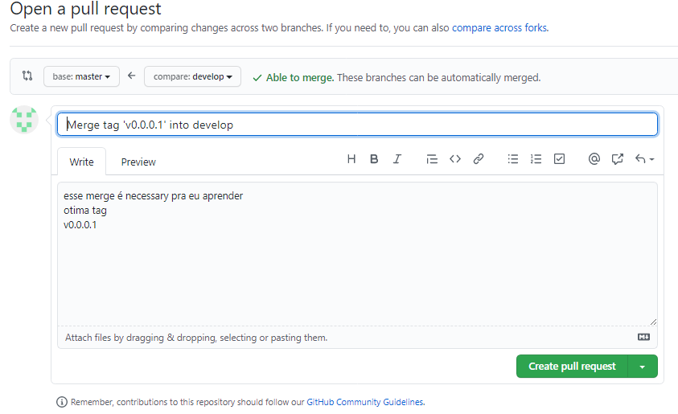
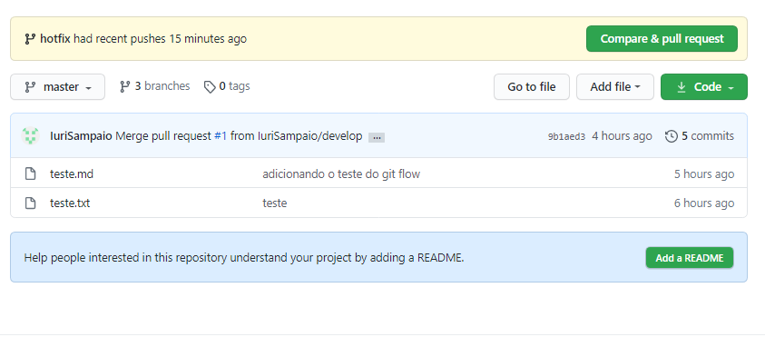

# Passo a passo para usar git flow

## Fluxo de trabalho

- **Uma ramificação de desenvolvimento é criada a partir da branch principal**
- **Uma ramificação de lançamento é criada a partir da ramificação de desenvolvimento**
- **Ramificações de recurso são criadas a partir da ramificação de desenvolvimento**
- **Quando um recurso é concluído, ele é mesclado na ramificação de desenvolvimento**
- **Quando a ramificação de lançamento é concluída, ela é mesclada nas ramificações de desenvolvimento e principal**
- **Caso um problema seja detectado na branch principal,uma ramificação de hotfix é criada a partir da principal**
- **Após a conclusão da ramificação de hotfix, ela é mesclada para as ramificações de desenvolvimento e principal**

**Esse passo a passo irá partir da brach master (principal) de um projeto e demonstar a criação de branchs, features, realeses, hotfix...** 
**conforme o fluxo descrito.**

` se você possui duvidas sobre a branching : `[Leia isso](https://www.git-scm.com/book/pt-br/v2/Git-Branching-Basic-Branching-and-Merging)

## Criando a branch develop

criando uma branch local de desenvolvimento

```vim
seunome@LAPTOP-K2TQRTRU MINGW64 ~/OneDrive/Área de Trabalho/TCC-Ache_me (master)
$ git branch develop
```

subindo a branch de desenvolvimento para o servidor

Esta ramificação vai conter o histórico completo do projeto, enquanto que a branch principal vai conter uma versão abreviada. Outros desenvolvedores agora vão precisar clonar o repositório central e criar uma ramificação de rastreamento para a de desenvolvimento.

```vim
seunome@LAPTOP-K2TQRTRU MINGW64 ~/OneDrive/Área de Trabalho/TCC-Ache_me (master)
$ git push -u origin develop
Total 0 (delta 0), reused 0 (delta 0), pack-reused 0
remote:
remote: Create a pull request for 'develop' on GitHub by visiting:
remote:      https://github.com/seunoome/teste/pull/new/develop
remote:
To https://github.com/seunome/teste.git
 * [new branch]      develop -> develop
Branch 'develop' set up to track remote branch 'develop' from 'origin'.
```

## Iniciando o repositório git flow

executar git flow init no repositório existente vai criar uma ramificação de desenvolvimento:

`APERTAR ENTER EM TODAS AS PERGUNTAS, USE O PADRÃO`

```vim

iuris@LAPTOP-K2TQRTRU MINGW64 ~/OneDrive/Área de Trabalho/teste (master)
$ git flow init

Which branch should be used for bringing forth production releases?
   - develop
   - master
Branch name for production releases: [master]

Which branch should be used for integration of the "next release"?
   - develop
Branch name for "next release" development: [develop]

How to name your supporting branch prefixes?
Feature branches? [feature/]
Bugfix branches? [bugfix/]
Release branches? [release/]
Hotfix branches? [hotfix/]
Support branches? [support/]
Version tag prefix? []
Hooks and filters directory? [C:/Users/iuris/OneDrive/Área de Trabalho/teste/.git/hooks]
```

## Criando uma feature

```vim
iuris@LAPTOP-K2TQRTRU MINGW64 ~/OneDrive/Área de Trabalho/teste (master)
$ git flow feature start testedefeature
Switched to a new branch 'feature/testedefeature'

Summary of actions:
- A new branch 'feature/testedefeature' was created, based on 'develop'
- You are now on branch 'feature/testedefeature'

Now, start committing on your feature. When done, use:

     git flow feature finish testedefeature

```

### Dentro da feature adiciona-se os códigos que foram alterados

```vim
iuris@LAPTOP-K2TQRTRU MINGW64 ~/OneDrive/Área de Trabalho/teste (feature/testedefeature)
$ git add .
```

**nunca esquecer de fazer commit**

```vim
iuris@LAPTOP-K2TQRTRU MINGW64 ~/OneDrive/Área de Trabalho/teste (feature/testedefeature)
$ git commit -m"adicionando o teste do git flow"
[feature/testedefeature e1706a5] adicionando o teste do git flow
 1 file changed, 1 insertion(+)
 create mode 100644 teste.md
```

### finalizando a feature e enviando pra develop

**note que ao finalizar a feature você tambem sera redirecionado para a develop**

```vim
iuris@LAPTOP-K2TQRTRU MINGW64 ~/OneDrive/Área de Trabalho/teste (feature/testedefeature)
$ git flow feature finish testedefeature
Switched to branch 'develop'
Your branch is up to date with 'origin/develop'.
Updating e67ecea..e1706a5
Fast-forward
 teste.md | 1 +
 1 file changed, 1 insertion(+)
 create mode 100644 teste.md
Deleted branch feature/testedefeature (was e1706a5).

Summary of actions:
- The feature branch 'feature/testedefeature' was merged into 'develop'
- Feature branch 'feature/testedefeature' has been locally deleted
- You are now on branch 'develop'


iuris@LAPTOP-K2TQRTRU MINGW64 ~/OneDrive/Área de Trabalho/teste (develop)
$

```

## Subindo da branch develop para a master

note que os arquivos que subimos para a develop só existe nela e o arquivo que subimos para a master existe nas duas, isso acontece pq o develop é uma ramificação da master.

```vim
iuris@LAPTOP-K2TQRTRU MINGW64 ~/OneDrive/Área de Trabalho/teste (master)
$ git checkout develop
Switched to branch 'develop'
Your branch is ahead of 'origin/develop' by 1 commit.
  (use "git push" to publish your local commits)

iuris@LAPTOP-K2TQRTRU MINGW64 ~/OneDrive/Área de Trabalho/teste (develop)
$ ls
teste.md  teste.txt


iuris@LAPTOP-K2TQRTRU MINGW64 ~/OneDrive/Área de Trabalho/teste (develop)
$ git checkout master
Switched to branch 'master'
Your branch is up to date with 'origin/master'.


iuris@LAPTOP-K2TQRTRU MINGW64 ~/OneDrive/Área de Trabalho/teste (master)
$ ls
teste.txt
```

```vim
iuris@LAPTOP-K2TQRTRU MINGW64 ~/OneDrive/Área de Trabalho/teste (master)
$ git flow release start v0.0.0.1
Branches 'develop' and 'origin/develop' have diverged.
And local branch 'develop' is ahead of 'origin/develop'.
Switched to a new branch 'release/v0.0.0.1'

Summary of actions:
- A new branch 'release/v0.0.0.1' was created, based on 'develop'
- You are now on branch 'release/v0.0.0.1'

Follow-up actions:
- Bump the version number now!
- Start committing last-minute fixes in preparing your release
- When done, run:

     git flow release finish 'v0.0.0.1'


iuris@LAPTOP-K2TQRTRU MINGW64 ~/OneDrive/Área de Trabalho/teste (release/v0.0.0.1)
$ git flow release finish v0.0.0.1
Branches 'develop' and 'origin/develop' have diverged.
And local branch 'develop' is ahead of 'origin/develop'.
Switched to branch 'master'
Your branch is up to date with 'origin/master'.
hint: Waiting for your editor to close the file...
```

ira aparecer um arquivo com o nome MERGE_MSG no seu editor de texto padrão,
neste irá conter :

```vim
Merge branch 'release/v0.0.0.1' into master
# Please enter a commit message to explain why this merge is necessary,
# POR FAVOR COMMIT UMA MENSAGEM PARA EXPLICAR O PQ ESSE MERGE É NESCESSARIO
# especially if it merges an updated upstream into a topic branch.
#
# Lines starting with '#' will be ignored, and an empty message aborts
# the commit.
```

```vim
Merge made by the 'recursive' strategy.
 teste.md | 1 +
 1 file changed, 1 insertion(+)
 create mode 100644 teste.md
Already on 'master'
Your branch is ahead of 'origin/master' by 2 commits.
  (use "git push" to publish your local commits)
hint: Waiting for your editor to close the file...
```

ira aparecer um arquivo para se configurar a tag da merge

```vim
Switched to branch 'develop'
Your branch is ahead of 'origin/develop' by 1 commit.
  (use "git push" to publish your local commits)
Already up to date!
hint: Waiting for your editor to close the file...
```

e depois um arquivo para realizar o commit final da merge

```vim
Merge made by the 'recursive' strategy.
Deleted branch release/v0.0.0.1 (was e1706a5).

Summary of actions:
- Release branch 'release/v0.0.0.1' has been merged into 'master'
- The release was tagged 'v0.0.0.1'
- Release tag 'v0.0.0.1' has been back-merged into 'develop'
- Release branch 'release/v0.0.0.1' has been locally deleted
- You are now on branch 'develop'


```

````vim
iuris@LAPTOP-K2TQRTRU MINGW64 ~/OneDrive/Área de Trabalho/teste (develop)
$ git tag
v0.0.0.1

iuris@LAPTOP-K2TQRTRU MINGW64 ~/OneDrive/Área de Trabalho/teste (develop)
$ git push -u origin develop
Enumerating objects: 6, done.
Counting objects: 100% (6/6), done.
Delta compression using up to 4 threads
Compressing objects: 100% (4/4), done.
Writing objects: 100% (5/5), 599 bytes | 299.00 KiB/s, done.
Total 5 (delta 2), reused 0 (delta 0), pack-reused 0
remote: Resolving deltas: 100% (2/2), done.
To https://github.com/IuriSampaio/teste.git
   e67ecea..a33b9a8  develop -> develop
Branch 'develop' set up to track remote branch 'develop' from 'origin'.
````

Agora os arquivos da branch develop foram adicionados a brach master

````js
iuris@LAPTOP-K2TQRTRU MINGW64 ~/OneDrive/Área de Trabalho/teste (develop)
$ git checkout master
Switched to branch 'master'
Your branch is ahead of 'origin/master' by 2 commits.
  (use "git push" to publish your local commits)

iuris@LAPTOP-K2TQRTRU MINGW64 ~/OneDrive/Área de Trabalho/teste (master)
$ ls
teste.md  teste.txt

iuris@LAPTOP-K2TQRTRU MINGW64 ~/OneDrive/Área de Trabalho/teste (master)
$ git checkout develop
Switched to branch 'develop'
Your branch is up to date with 'origin/develop'.

iuris@LAPTOP-K2TQRTRU MINGW64 ~/OneDrive/Área de Trabalho/teste (develop)
$ ls
teste.md  teste.txt
````

com os arquivos na branch master local basta realizar o git push

```vim
iuris@LAPTOP-K2TQRTRU MINGW64 ~/OneDrive/Área de Trabalho/teste (master)
$ git push
Total 0 (delta 0), reused 0 (delta 0), pack-reused 0
To https://github.com/IuriSampaio/teste.git
   e67ecea..eea3cbe  master -> master

```

## Criando uma pull request e dando um merge





## Criando uma branch hotfix

### segue-se o mesmo passo para a criação de uma branch develop, mas não cria-se features ou realeses, pois a hotfix é um feature diretamente na master

```vim
iuris@LAPTOP-K2TQRTRU MINGW64 ~/OneDrive/Área de Trabalho/teste (master)
$ git branch hotfix

iuris@LAPTOP-K2TQRTRU MINGW64 ~/OneDrive/Área de Trabalho/teste (master)
$ git branch
  develop
  hotfix
* master

iuris@LAPTOP-K2TQRTRU MINGW64 ~/OneDrive/Área de Trabalho/teste (master)
$ git push -u origin hotfix
Total 0 (delta 0), reused 0 (delta 0), pack-reused 0
remote:
remote: Create a pull request for 'hotfix' on GitHub by visiting:
remote:      https://github.com/IuriSampaio/teste/pull/new/hotfix
remote:
To https://github.com/IuriSampaio/teste.git
 * [new branch]      hotfix -> hotfix
Branch 'hotfix' set up to track remote branch 'hotfix' from 'origin'.

iuris@LAPTOP-K2TQRTRU MINGW64 ~/OneDrive/Área de Trabalho/teste (master)
$ git checkout hotfix
Switched to branch 'hotfix'
Your branch is up to date with 'origin/hotfix'.


iuris@LAPTOP-K2TQRTRU MINGW64 ~/OneDrive/Área de Trabalho/teste (hotfix)
$ git add .

iuris@LAPTOP-K2TQRTRU MINGW64 ~/OneDrive/Área de Trabalho/teste (hotfix)
$ git commit -m"some error"
[hotfix afef32d] some error
 1 file changed, 2 insertions(+), 1 deletion(-)

iuris@LAPTOP-K2TQRTRU MINGW64 ~/OneDrive/Área de Trabalho/teste (hotfix)
$ git push -u origin hotfix
Everything up-to-date
Branch 'hotfix' set up to track remote branch 'hotfix' from 'origin'.

iuris@LAPTOP-K2TQRTRU MINGW64 ~/OneDrive/Área de Trabalho/teste (hotfix)
$ git pull
remote: Enumerating objects: 1, done.
remote: Counting objects: 100% (1/1), done.
remote: Total 1 (delta 0), reused 0 (delta 0), pack-reused 0
Unpacking objects: 100% (1/1), 651 bytes | 8.00 KiB/s, done.
From https://github.com/IuriSampaio/teste
   eea3cbe..9b1aed3  master     -> origin/master
Already up to date.

```

### Os arquivos que estão na master e na hotfix possuem conteudos diferentes, portanto irá causar conflito

```vim
iuris@LAPTOP-K2TQRTRU MINGW64 ~/OneDrive/Área de Trabalho/teste (hotfix)
$ cat teste.md
# fazendo testes com o git flow
## fixing bug with teste.md

iuris@LAPTOP-K2TQRTRU MINGW64 ~/OneDrive/Área de Trabalho/teste (hotfix)
$ git checkout master
Switched to branch 'master'
Your branch is ahead of 'origin/master' by 1 commit.
  (use "git push" to publish your local commits)

iuris@LAPTOP-K2TQRTRU MINGW64 ~/OneDrive/Área de Trabalho/teste (master)
$ cat teste.md
# fazendo testes com o git flow
## possui um bug aqui

```

Agora basta dar o git merge

```vim
iuris@LAPTOP-K2TQRTRU MINGW64 ~/OneDrive/Área de Trabalho/teste (master)
$ git merge hotfix
Auto-merging teste.md
CONFLICT (content): Merge conflict in teste.md
Automatic merge failed; fix conflicts and then commit the result.
```

Essa resposta do comando significa que há conflito na branch hotfix em relação a master

para  resolver isso basta realizar o pull request como demonstrado anteriomente



Após realizar o pull request resultará:


Se durante o pull request ele disse que havia conflitos, basta seguir oque é dito pelo git para resolver esses conflitos.